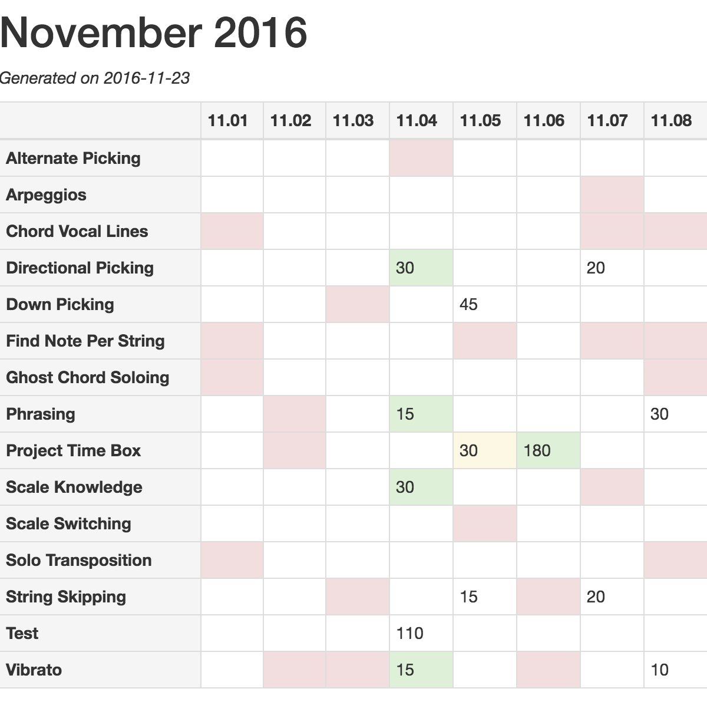
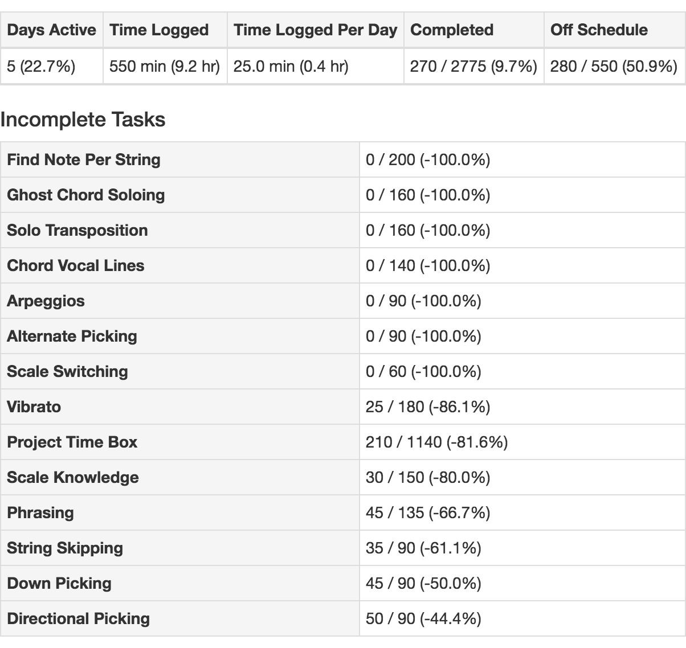

# Versed

Versed turns monthly activity logs into a clean visualization of your progress
against your monthly goals.

## Install

```
$ gem install versed
```

## Usage

```
$ versed -h
usage: versed [-h] [--version]
       versed <schedule> <log> [output_path]

    -h, --help                       Print usage information
        --version                    Print version

Versed takes in a schedule and weekly log (as YAML files) and outputs a
visualization of time spent this week (in an HTML page).
```

## Input

See `examples` for a real world example.

```
# schedule.yaml

Sunday:
  Task 1: 60 # time in minutes

Monday:
  Task 1: 60
  Task 2: 120

Tuesday:
  Task 2: 60
  Task 3: 30

Wednesday:
  Task 1: 30
  Task 3: 30

Friday:
  Task 4: 60

```

```
# log.yaml
#
# Note: A log is expected to only contain entries from a single month.

2016.11.01:
  Task 1: 45

2016.11.02:
  Task 4: 75

2016.11.03:
  Task 1: 15

2016.11.04:
  Task 1: 15
  Task 3: 60

...
```

## Output

Versed outputs an HTML page that visualizes the conformance of your logged
activities to your schedule.




## License

MIT.
